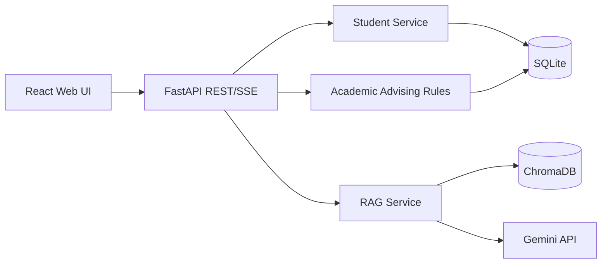
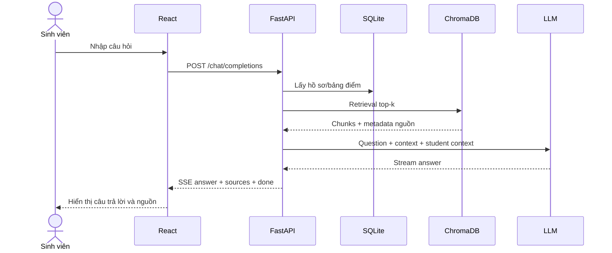
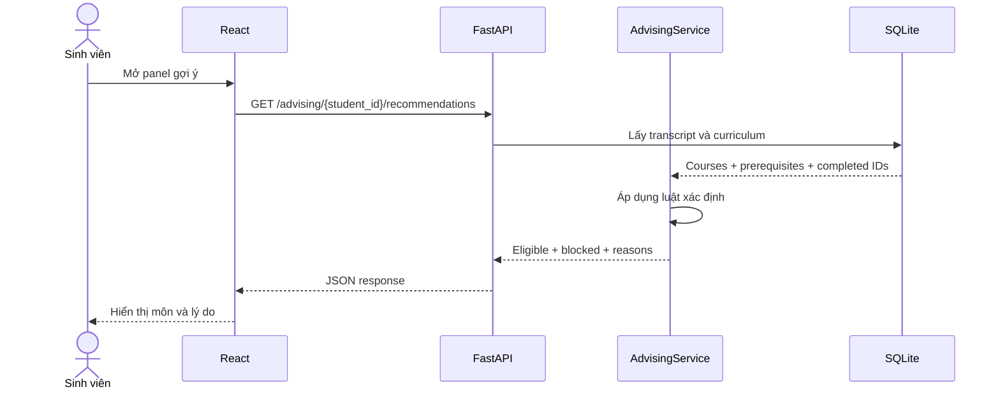

# Hồ sơ phân tích và thiết kế hệ thống

## 1. Kiến trúc tổng thể

Luồng tư vấn học tập gồm hai nhánh:

1. `Academic Advising Rules` xử lý dữ liệu có tính quyết định: môn đã học, tín chỉ, học kỳ và tiên quyết.
2. `RAG Service` truy xuất tài liệu chính thức và dùng LLM để diễn giải. LLM không được tự quyết định điều kiện môn học.

## 2. Use case chính

| Tác nhân | Use case | Kết quả |
|---|---|---|
| Sinh viên | Đăng nhập bằng MSSV mẫu | Nhận hồ sơ cá nhân |
| Sinh viên | Xem tiến độ/bảng điểm | Biết tín chỉ, GPA và môn đã hoàn thành |
| Sinh viên | Xem gợi ý môn | Nhận danh sách đủ điều kiện và môn bị khóa |
| Sinh viên | Hỏi đáp học vụ | Câu trả lời có nguồn tài liệu |
| Sinh viên | Hỏi thủ tục/nghề nghiệp | Câu trả lời theo tài liệu tương ứng |
| Quản trị viên | Nạp tài liệu | Cập nhật ChromaDB |

## 3. Sequence: câu hỏi RAG

## 4. Sequence: gợi ý môn học

## 5. API contract cốt lõi

| Method | Endpoint | Mục đích |
|---|---|---|
| `POST` | `/api/v1/students/login` | Đăng nhập demo |
| `GET` | `/api/v1/students/{id}/transcript` | Bảng điểm |
| `GET` | `/api/v1/students/{id}/progress` | Tiến độ |
| `GET` | `/api/v1/advising/{id}/recommendations` | Gợi ý môn có kiểm tra tiên quyết |
| `POST` | `/api/v1/chat/completions` | Chat SSE có nguồn |
| `POST` | `/api/v1/documents/ingest` | Nạp tài liệu |

## 6. Nguyên tắc an toàn và giới hạn

- Không đưa API key vào source hoặc commit.
- Không coi câu trả lời LLM là quyết định đăng ký học chính thức.
- Mọi thông tin quy chế phải có nguồn hoặc nêu rõ không đủ bằng chứng.
- Hồ sơ sinh viên mẫu phải được ẩn danh; dữ liệu thật chỉ dùng khi có quyền.
- Dữ liệu curriculum và prerequisite phải được GVHD/chuyên gia nghiệp vụ xác nhận.
